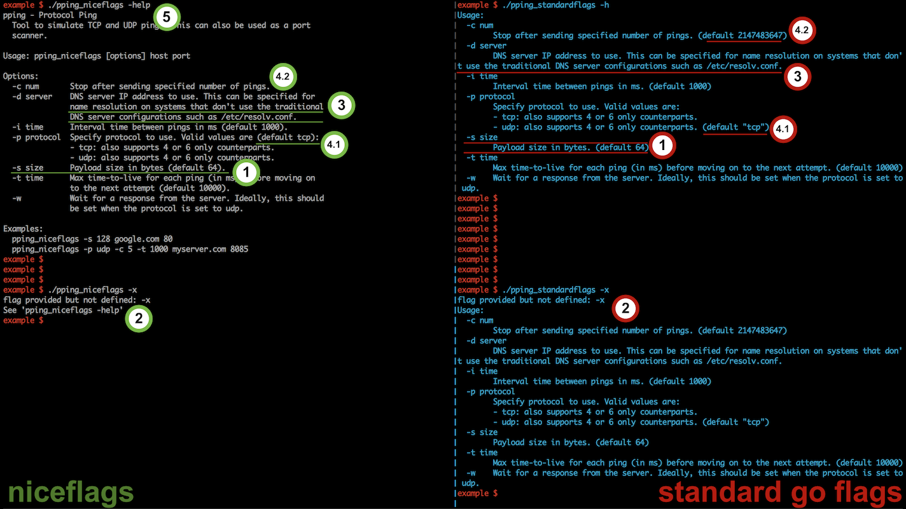

niceflags - Nicer help text for the Go flag package
===================================================

`niceflags` is a lightweight drop-in replacement for the standard `flag` package. It offers a cleaner POSIX
style help page as opposed to the one offered by the standard `flag` package. It does not re-implement any
of the `flag` package functions except `Usage()`.

Features
--------


1. Description starts at the same line as the flag name.
1. Users are notified about the help flag instead of cluttering the screen with the help page when there's an error in usage.
1. Appropriate indenting and wrapping when the flag descriptions don't fit in the current line.
1. Default value printing options:
    1. Can be embedded anywhere in the flag description with the special back-quoted literal: ``` `default` ```.
    Example:
        ```
        payloadSize := flags.Int("s", 64, "Payload `size` in bytes `default`.")

        will show up as:
          -s size    Payload size in bytes (default=64).
        ```
    2. Can be omitted.
1. Includes title, description and examples.

Install library
---------------
```
go get github.com/codeliveroil/niceflags
```

Usage
-----
```golang
import "github.com/codeliveroil/niceflags"

// Create flag-set
flags := niceflags.NewFlags(commandName, title, description, usageOptions, helpFlagName, printAllDefaults)

// Describe individual flags with the 'flags' object as you would with
// the standard flag package.
// Notes:
//   - Don't describe the help flag. This will be created automatically
//     using the helpFlagName.
//   - Type names can be specified within double back-quotes in the flag
//     usage/description. These will be displayed right next to the flag
//     name.
//   - The back-quoted literal `default` can be placed anywhere in the flag
//     description/usage and niceflags will replace that with the non-Zero
//     default value for the flag.

// Parse
err := flags.Parse(args)
// handle error

// Check if -help has been invoked (optional)
flags.Help()

// Proceed to handle flags and other parameters
```

Example
----------
```golang
import "github.com/codeliveroil/niceflags"

func main() {
	// Create flag set
	flags := niceflags.NewFlags(
		os.Args[0],
		"pping - Protocol Ping",
		"Tool to simulate TCP and UDP pings. This can also be used as a port scanner.",
		"[options] host port", // Note that you don't specify the command name here
		"help",
		false)

	// Optionally add some examples
	// Note that you don't specify the command name here
	flags.Examples = []string{
		"-s 128 google.com 80",
		"-p udp -c 5 -t 1000 myserver.com 8085",
	}

	// Describe flags with the 'flags' object as you would with
	// the standard flag package
	// Note the usage of the special back-quoted `default` formatter along with the
	// standard back-quoted parameter types.
	payloadSize := flags.Int("s", 64, "Payload `size` in bytes `default`.")
	protocol := flags.String("p", "tcp", "Specify `protocol` to use. Valid values are `default`:\n"+
		"- tcp: also supports 4 or 6 only counterparts.\n"+
		"- udp: also supports 4 or 6 only counterparts.")
	wait := flags.Bool("w", false, "Wait for a response from the server. Ideally, this should be "+
		"set when the protocol is set to udp.")
	count := flags.Int("c", math.MaxInt32, "Stop after sending specified `num`ber of pings.")

	// Parse
	err := flags.Parse(os.Args[1:])
	if err != nil {
		niceflags.PrintErr("unexpected error: %v\n", err)
		os.Exit(1)
	}

	// Check if -help has been invoked (optional)
	flags.Help()

	// Parse non-flag arguments
	argc := len(os.Args)
	if argc < 3 { //because we have a couple of non-flag options: host and port
		flags.Usage() //simply notifies user about the '-help' option,
		// doesn't print the entire help manual.
		os.Exit(0)
	}

	host := os.Args[argc-2]
	port, _ := strconv.Atoi(os.Args[argc-1])

	// Proceed to handle flags and other parameters
	fmt.Println(host, port, payloadSize, protocol, wait, count)
}
```
